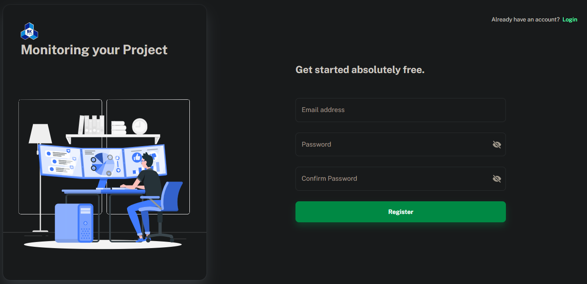
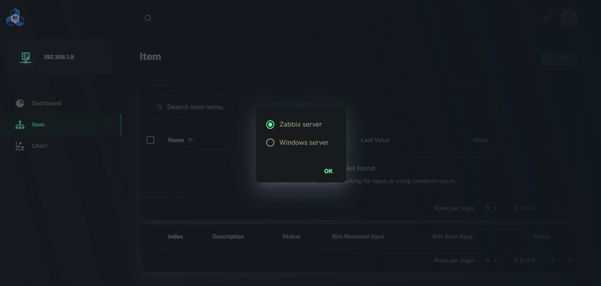
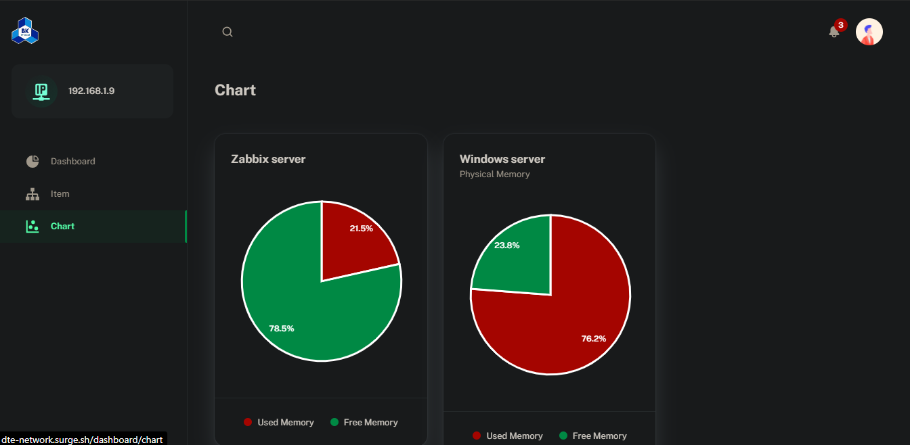

# [Monitoring Network System](http://dte-network.surge.sh/)

[[Set up Zabbix server]](src/documents/SetUpZabbix.md)

[[Set up Zabbix notifcations via email]](src/documents/SetUpAlert.md)

> Dashboard made with Material-UI components and React.

# Introduction

## Introduction topic

- Web-based allow users to monitor network system via Zabbix server.

## Technology

- Programming language: HTML, CSS, Javascript
- Server: Zabbix
- Database: MySQL (in Zabbix)
- Library:
  - Axios: Promise based HTTP client for the browser and node.js.
  - Material UI: Build awesome Web UI quickly and easily.
  - Zabbix RPC.

# Main Functions

## Register new user

- Just enter the necessary information such as name, email, password to be able to register a new account.

## Reset your password

- The user can retrieve the forgotten password via the previously registered email.

- Change password successfully and user login again.

- Host information

## Enter the IP Address

- Enter the IP Address and press GET button.

- Host information

- Notifications

- Click  to choose the host server.

- Item information

- Chart Information

## References

- https://www.zabbix.com/documentation/5.0/manual/api
- https://github.com/axios/axios
- https://github.com/FaCuZ/zabbix-rpc#readme
- https://blog.zabbix.com/zabbix-api-explained/9155/

## Contact us

- huy.bui38@hcmut.edu.vn
- tu.do.bk.la@hcmut.edu.vn
