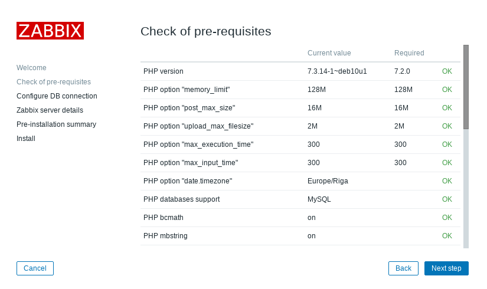

# SET UP ZABBIX SERVER ON CentOS

## Step 1

```sh
$ yum update
$ dnf install httpd
$ systemctl start httpd
$ systemctl enable httpd
$ firewall -cmd --permanent --add-service=httpd
$ firewall-cmd --permanent --list-all
$ firewall-cmd --reload
```

## Step 2

- Set up MariaDB Database

```sh
$ dnf install mariadb-server
$ systemctl start mariadb
$ systemctl enable mariadb
$ mysql -u root -p
```

- In MariaDB terminal, create a database username and password

```sh
MariaDB[ (none) ] > create database zabbix_db character set utf8 collate utf8_bin;
MariaDB[ (none) ] > create user zabbix_user@localhost identified by '123';
MariaDB[ (none) ] > grant all privileges on zabbix_db.* to zabbix_user@localhost;
MariaDB[ (none) ] > flush privileges;
MariaDB[ (none) ] > \q
```

## Step 3

- Download and Install Zabbix 5.0

```sh
$ rpm -Uvh https://repo.zabbix.com/zabbix/5.0/rhel/8/x86_64/zabbix-release-5.0-1.el8.n
$ dnf clean all
$ dnf install zabbix-server-mysql zabbix-web-mysql zabbix-apache-conf zabbix-agent
$ zcat /usr/share/doc/zabbix-server-mysql*/create.sql.gz | mysql -uzabbix_user -p zabbix_db
```

- Edit in file `/etc/zabbix/zabbix_server.conf`

```sh
$ vim /etc/zabbix/ zabbix_server.conf
```

- Add information about name, user and password

```php
DBName = zabbix_db
DBUser = zabbix_user
DBPassword = 123
```

- Change timezone in file `/etc/php-fpd.d/zabbix.conf`

```sh
$ vi /etc/php-fpm.d/zabbix.conf
```

```php
php_value[date.timezone] = Asia/Ho_Chi_Minh
```

## Step 4: Restart all services

```sh
$ systemctl restart zabbix-server zabbix-agent httpd php-fpm
$ systemctl restart zabbix-server
$ systemctl status zabbix-server.service
$ systemctl enable zabbix-server zabbix-agent httpd php-fpm
```

- Change Selinux status

```sh
$ vi /etc/selinux/config
```

```php
SELINUX=disabled
```

## Step 5: Configure web frontend using URL _*"http://server_ip_or_dns_name/zabbix"*_

<p align="center"></img></p>

<p align="center"><em>Figure 1: Welcome screen</em></p>

<p align="center"></img></p>

<p align="center"><em>Figure 2: Pre-requisites check</em></p>

<p align="center"></img></p>

<p align="center"><em>Figure 3: Configure DB connection</em></p>

<p align="center"></img></p>

<p align="center"><em>Figure 4: Configure Zabbix server</em></p>

<p align="center"></img></p>

<p align="center"><em>Figure 5: Pre-installation summary</em></p>

<p align="center"></img></p>

<p align="center"><em>Figure 6: Finish</em></p>

## Step 6: Login to frontend using Zabbix default login credentials

Use Zabbix default admin username **"Admin"** and password **"zabbix"** (without quotes) to login to Zabbix frontend at URL _*“http://server_ip_or_dns_name/zabbix”*_ via your browser.

<p align="center"></img></p>

<p align="center"><em>Figure 7: Zabbix login page</em></p>

<p align="center"></img></p>

<p align="center"><em>Figure 8: Zabbix 5.0 dashboard</em></p>
